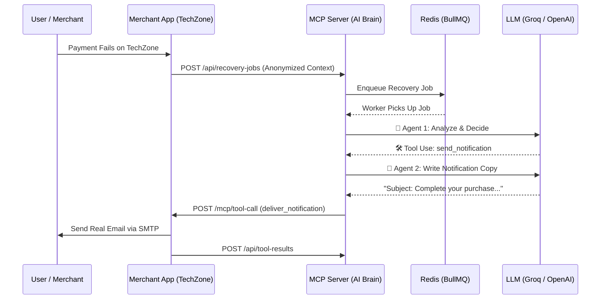

# ⚡ Agentic AI Payment Recovery System

An intelligent, multi-agent system designed to automatically recover failed payments and provide real-time conversational analytics for merchants. 

The core innovation of this project is its **Model Context Protocol (MCP) Client-Server Architecture**. It strictly isolates the AI intelligence from sensitive merchant data. The AI dynamically analyzes failure contexts, writes personalized notifications, executes optimal recovery strategies, and answers complex analytical questions—all without ever having direct access to the merchant's underlying database or PII.

To demonstrate this system in action, I have built **TechZone**, a fully functioning mock e-commerce storefront and admin dashboard that acts as the "Merchant Client".

---

## 📸 Core Capabilities & Demo Features

### 1. The MCP Architecture (Privacy-First AI)
The system is explicitly decoupled into two main components to maintain a strict trust boundary:
* **The MCP Server (The Brain):** Coordinates the LLM agents via BullMQ queues. It has no direct access to merchant databases.
* **The Merchant App / TechZone (The Client):** Houses sensitive PII, the local database, and executes the final tools (like sending emails) only when instructed by the MCP server.

### 2. Multi-Agent Intelligence
The system uses specialized agents to break down problems efficiently:
* **Recovery Decision Agent**: Analyzes failure context (attempt count, amount, reason) and dynamically chooses between tools like `retry_payment`, `send_notification`, `escalate_to_human`, or `do_nothing`.
* **Notification Writer Agent**: Drafts channel-appropriate, context-aware copy (SMS or SMTP Email) tailored precisely to the failure reason.
* **Merchant Intelligence Agent**: A conversational data analyst built into the merchant dashboard. It uses secure tools to fetch sanitized analytics arrays and process them into markdown tables and insights.

### 3. The "TechZone" Demo Environment
A complete, mock e-commerce stack built to showcase the AI:
* **E-commerce Simulator:** Trigger dynamic payment failure scenarios (e.g., Insufficient Funds, Fraud Block) and watch the AI agents intervene in real-time.
* **Premium Admin Dashboard:** Built with glassmorphism and Chart.js. Features a Donut chart for Failure Breakdown, a 7-day Recovery Trend line, a Customer Risk Leaderboard, and an Audit Trail.
* **Integrated AI Chat:** Chat directly with the Merchant Intelligence Agent inside the dashboard (e.g., *"Which failure category costs us the most?"*).

---

## 🏗️ Interaction Flow



---

## 🛠️ Tech Stack

| Category | Technology | Purpose |
| :--- | :--- | :--- |
| **Language** | TypeScript / Node.js | Strong typing across architectural boundaries. |
| **Web Framework** | Express.js | API routing for both servers. |
| **Database ORM** | Prisma | Schema management & queries. |
| **Databases** | SQLite | Dual isolated DBs (`dev.db` & `mcp.db`). |
| **Job Queue** | BullMQ + Redis | Robust background processing for async AI tasks. |
| **AI Provider** | Groq / OpenAI SDK | Extremely fast LLM inference (`openai/gpt-oss-120b`). |
| **Email Delivery** | Nodemailer (SMTP) | Configured for real email delivery (e.g., Gmail App Passwords). |
| **UI / UX** | HTML5, CSS3, Chart.js, Lucide | Premium, zero-framework reactive UI design for the TechZone demo. |

---

## 🚀 Getting Started

### Prerequisites
* Node.js (v18+)
* Redis running locally (default port `6379`)
* A Groq API Key (or OpenAI-compatible equivalent)
* Gmail App Password (for SMTP delivery in demo)

### Installation

1. **Clone & Install Dependencies**
   ```bash
   cd merchant-app && npm install
   cd ../mcp-server && npm install
   ```

2. **Database Setup & Seeding**
   ```bash
   # Initialize Merchant App DB and seed TechZone products/customers
   cd merchant-app
   npx prisma db push
   npm run seed

   # Initialize MCP Server DB
   cd ../mcp-server
   npx prisma db push
   ```

3. **Environment Variables**
   * Create a `.env` file in **both** `merchant-app` and `mcp-server`.
   * **mcp-server/.env**:
     ```env
     OPENAI_API_KEY=your_groq_api_key
     OPENAI_BASE_URL=https://api.groq.com/openai/v1
     REDIS_HOST=127.0.0.1
     REDIS_PORT=6379
     ```
   * **merchant-app/.env**:
     ```env
     SMTP_HOST=smtp.gmail.com
     SMTP_PORT=587
     SMTP_USER=your_email@gmail.com
     SMTP_PASS=your_app_password
     ```

### Running the System

Run both servers concurrently in separate terminal windows:

**Terminal 1 (Merchant Client - Port 3000):**
```bash
cd merchant-app
npm run dev
```

**Terminal 2 (MCP AI Server - Port 3001):**
```bash
cd mcp-server
npm run dev
```

### Usage
1. Open `http://localhost:3000` to view the TechZone simulated storefront and trigger payment failures.
2. Open `http://localhost:3000/admin.html` to view the live intelligence dashboard and chat with the AI Analyst about the recovery data.
