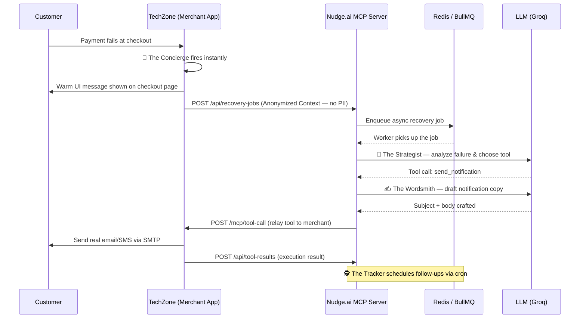

# ⚡ Nudge.ai — Agentic Payment Recovery System

> **Nudge.ai** is an intelligent, multi-agent system that automatically recovers failed payments for merchants — in real-time, at scale, and without ever touching sensitive customer data.

Built on a **Model Context Protocol (MCP) Client-Server Architecture**, Nudge.ai deploys a specialized team of five AI agents that collaborate to rescue a failed payment — from the moment the transaction drops to the final follow-up email days later.

To showcase the system in action, we built **TechZone** — a fully functioning mock e-commerce storefront and admin dashboard that acts as the merchant client.

---

## 🤖 Meet the Team — The Five Agents of Nudge.ai

| Agent | Role | What It Does |
| :--- | :--- | :--- |
| 🎩 **The Concierge** | Checkout UI Agent | Fires the instant a payment fails. Generates a warm, human-sounding UI message to hold the customer on the page and prevent immediate drop-off. |
| 🧠 **The Strategist** | Immediate Action Agent | The core decision-maker. Analyses the anonymized failure context (category, amount, attempt count) and decides whether to notify, escalate, or do nothing. |
| ✍️ **The Wordsmith** | Notification Writer Agent | Drafts the actual message content — empathetic, context-aware, and channel-appropriate (email or SMS). Never mentions internal tool names or bank error codes. |
| 🕵️ **The Tracker** | Follow-up Agent | Runs silently in the background on a cron schedule. Monitors unresolved failure events and orchestrates the follow-up drip campaign — one nudge at a time. |
| 📊 **The Analyst** | Admin Intelligence Agent | Lives in the merchant dashboard. Answers plain-English questions about recovery performance by securely fetching anonymized analytics and explaining them in clear, conversational insights. |

---

## 🏗️ Architecture — How It Works

The core innovation of Nudge.ai is its **strict trust boundary** between the AI brain and the merchant's sensitive data.

```
┌─────────────────────────────────────────────────────────┐
│                  MERCHANT APP (TechZone)                 │
│            Port 3000 — The MCP Client                    │
│                                                          │
│  ┌──────────┐   ┌──────────────┐   ┌──────────────────┐ │
│  │ TechZone │   │  MCP Client  │   │   Local Tools    │ │
│  │Storefront│   │   Service    │   │ (Email, SMS, DB) │ │
│  └────┬─────┘   └──────┬───────┘   └────────┬─────────┘ │
│       │                │                     │           │
└───────┼────────────────┼─────────────────────┼───────────┘
        │ Payment Fails   │ Anonymized Context  │Tool Results
        ▼                ▼                     ▲
┌─────────────────────────────────────────────────────────┐
│                MCP SERVER (AI Brain)                     │
│            Port 3001 — Zero PII Access                   │
│                                                          │
│  ┌──────────────┐  ┌──────────┐  ┌──────────────────┐   │
│  │ The Concierge│  │  BullMQ  │  │  The Strategist  │   │
│  │(Instant UI)  │  │  Queue   │  │  (Decisions)     │   │
│  └──────────────┘  └────┬─────┘  └──────────────────┘   │
│                         │                                │
│  ┌──────────────┐  ┌────▼─────┐  ┌──────────────────┐   │
│  │ The Wordsmith│  │  Redis   │  │   The Tracker    │   │
│  │  (Copy)      │  │          │  │ (Cron Follow-up) │   │
│  └──────────────┘  └──────────┘  └──────────────────┘   │
└─────────────────────────────────────────────────────────┘
```

### The MCP Flow — Step by Step



---

## 🛠️ Tech Stack

| Category | Technology | Purpose |
| :--- | :--- | :--- |
| **Language** | TypeScript / Node.js | Strong typing across both servers |
| **Web Framework** | Express.js | API routing for both MCP client & server |
| **Database** | SQLite + Prisma | Dual isolated DBs — merchant DB & MCP job DB |
| **Job Queue** | BullMQ + Redis | Async background processing of AI recovery jobs |
| **AI Provider** | Groq (OpenAI SDK) | Fast LLM inference via `openai/gpt-oss-120b` |
| **Email Delivery** | Nodemailer (SMTP) | Real email delivery via Gmail App Password |
| **Admin UI** | HTML5, CSS3, Chart.js | Premium glassmorphism dashboard with live charts |
| **Shared Logger** | Custom `shared/logger.ts` | IST-timestamped, structured terminal output for both servers |

---

## 📁 Project Structure

```
Nudge.ai/
├── shared/
│   └── logger.ts                  # Shared IST-aware logger used by both servers
│
├── mcp-server/                    # The AI Brain (Port 3001)
│   └── src/
│       ├── agents/
│       │   ├── checkoutUIAgent.ts          # 🎩 The Concierge
│       │   ├── immediateActionAgent.ts     # 🧠 The Strategist
│       │   ├── notificationWriterAgent.ts  # ✍️ The Wordsmith
│       │   ├── followUpAgent.ts            # 🕵️ The Tracker
│       │   └── merchantIntelligenceAgent.ts # 📊 The Analyst
│       ├── queue/
│       │   ├── jobQueue.ts                 # BullMQ queue definition
│       │   └── recoveryWorker.ts           # Worker that processes recovery jobs
│       ├── cron/
│       │   └── followUpPoller.ts           # Cron that triggers The Tracker
│       └── services/
│           └── recoveryJobService.ts       # Entry point for new recovery jobs
│
└── merchant-app/                  # TechZone Demo Client (Port 3000)
    ├── src/
    │   └── services/
    │       ├── webhookService.ts           # Handles Razorpay webhook events
    │       └── emailService.ts             # SMTP email delivery
    ├── mcp-client/
    │   └── recovery-intelligence/
    │       ├── recoveryAgentMCPClientService.ts  # Submits jobs to MCP server
    │       ├── mcpCallbackController.ts          # Receives tool calls from MCP server
    │       └── tools/                            # Executable tool implementations
    │           ├── sendNotificationTool.ts
    │           ├── escalateToHumanTool.ts
    │           └── doNothingTool.ts
    └── public/
        ├── index.html                      # TechZone Storefront
        ├── product.html                    # Product + Checkout Page
        ├── admin.html                      # Admin Recovery Dashboard
        └── style.css                       # Global design system
```

---

## 🚀 Getting Started

### Prerequisites
- Node.js v18+
- Redis running locally on port `6379`
- A Groq API key (or any OpenAI-compatible endpoint)
- Gmail App Password (for SMTP email delivery)

### 1. Install Dependencies
```bash
cd merchant-app && npm install
cd ../mcp-server && npm install
```

### 2. Environment Variables

**`mcp-server/.env`**
```env
OPENAI_API_KEY=your_groq_api_key
OPENAI_BASE_URL=https://api.groq.com/openai/v1
REDIS_HOST=127.0.0.1
REDIS_PORT=6379
MERCHANT_CALLBACK_URL=http://localhost:3000/mcp
```

**`merchant-app/.env`**
```env
DATABASE_URL=file:./dev.db
MCP_SERVER_URL=http://localhost:3001
SMTP_HOST=smtp.gmail.com
SMTP_PORT=587
SMTP_USER=your_email@gmail.com
SMTP_PASS=your_gmail_app_password
SMTP_FROM_NAME=TechZone
RAZORPAY_KEY_ID=your_razorpay_key
RAZORPAY_KEY_SECRET=your_razorpay_secret
WEBHOOK_SECRET=your_webhook_secret
```

### 3. Database Setup
```bash
# Merchant App DB
cd merchant-app
npx prisma db push
npm run seed

# MCP Server DB
cd ../mcp-server
npx prisma db push
```

### 4. Run Both Servers

Open two terminal windows:

```bash
# Terminal 1 — Merchant App (TechZone)
cd merchant-app && npm run dev

# Terminal 2 — Nudge.ai MCP Server
cd mcp-server && npm run dev
```

### 5. Demo
- **Storefront:** `http://localhost:3000` — Browse products, trigger payment failures, watch The Concierge fire instantly.
- **Admin Dashboard:** `http://localhost:3000/admin` — View live recovery analytics, failure breakdowns, risk leaderboard, and chat with **The Analyst**.

---

## 🔍 Pre-Seeded Demo Data

The seed script creates a rich, realistic dataset ready for immediate demo use:

| # | Customer | Failure Type | Status | Recovery Chain |
| :- | :--- | :--- | :--- | :--- |
| 1 | Arjun Sharma | Insufficient Funds | 🔴 Escalated | 1 SMS → 2 Emails → Escalated |
| 2 | Priya Patel | Wrong PIN | 🟡 Pending | Waiting for AI agent |
| 3 | Ravi Kumar | Abandoned | 🟡 Pending | Waiting for AI agent |
| 4 | Sneha Iyer | Do Not Honor | 🔴 Escalated | 2 Emails → Escalated |
| 5 | Vikram Nair | PSP Timeout | 🔴 Escalated | Do Nothing → Escalated |

---

*Built with ❤️ to demonstrate the power of Agentic AI in real-world financial infrastructure.*